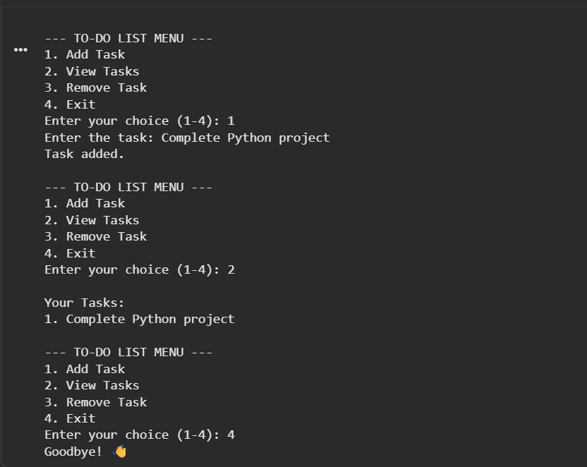

# 📝 Python To-Do List

A simple command-line **To-Do List application** built using Python.  
This program allows users to add tasks, view tasks, and remove completed tasks through an interactive menu.

---

## 📌 Features

- Add new tasks
- View all tasks
- Remove completed tasks
- Simple and interactive menu
- Beginner-friendly Python project

---

## 🛠 Technologies Used

- Python
- Lists
- Loops
- Functions
- Conditional statements

---

## 📷 Project Demo

Example output of the program:

---

## ⚙️ How It Works

1. The program displays a menu with options.
2. Users can choose to:
   - Add a task
   - View tasks
   - Remove a task
3. Tasks are stored in a Python list during program execution.
4. The program runs until the user chooses **Exit**.

---

## ▶️ How to Run the Program

1. Install **Python** on your computer.
2. Download or clone this repository.
3. Run the program: todo.py

---

## 🎯 Learning Outcomes

This project helped me practice:

- Python programming fundamentals
- Lists and loops
- User input handling
- Program structure and logic

---

## 👨‍💻 Author

**Alyx Joy Sarath**  
BTech Computer Science Student  
Interested in Python, Robotics, and Problem Solving.

